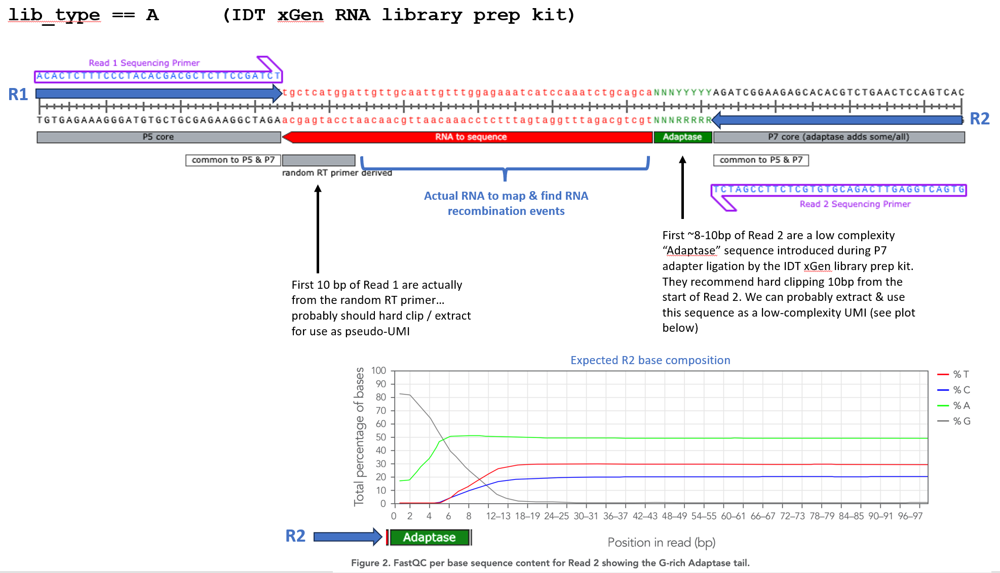
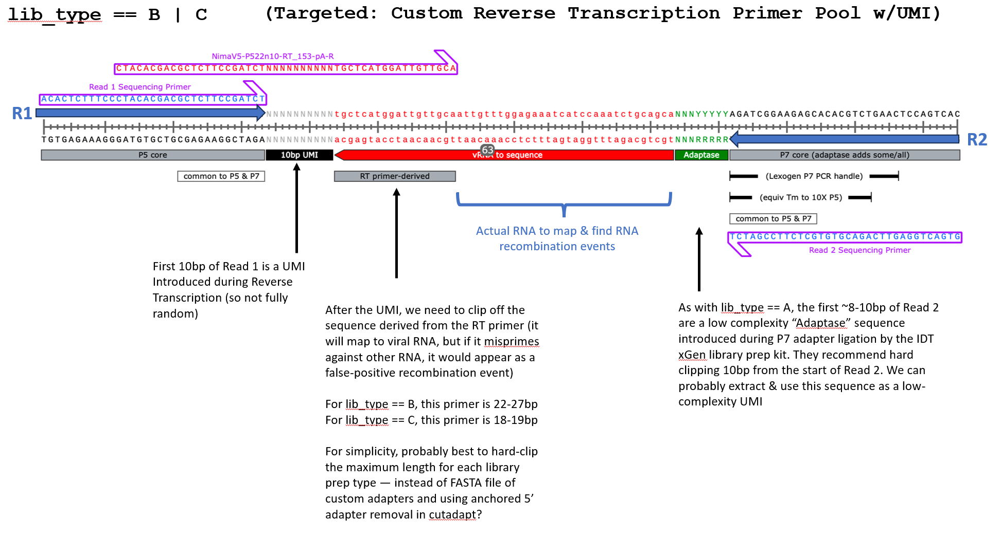

# nf-vjunc

## Description

`nf-vjunc` is a Nextflow (DSL2) pipeline that preprocesses paired-end RNA-seq reads and performs steps to detect viral splicing and junctions. It trims adapters, extracts UMIs, merges overlapping reads, and prepares combined FASTQ outputs for downstream analysis.

## High-level workflow

- Read sample metadata from a samplesheet (CSV).
- Trim adapters with Trim Galore (`TRIMGALORE`).
- Extract UMIs with `umi_tools` (`UMITOOLS`).
- Merge overlapping reads with `FLASH` and post-process with `FASTX`.

## Pipeline steps (what it does)

1. METADATA: load the samplesheet and emit tuples of (sample, fastq1, fastq2, gtf, fasta, library).
2. TRIMGALORE: adapter-trim paired reads and produce trimmed FASTQ files named `${sample}_val_1.fq.gz`/`_val_2.fq.gz`.
3. UMITOOLS: extract UMIs from trimmed FASTQs and write UMI-extracted FASTQs and logs.
4. HARDTRIM: Depending on library type, hard trim "x" bases from R1.
5. FLASH: merge overlapping paired reads (produces extendedFrags and notCombined files).
6. FASTX: reverse-complement and combine files into a single combined FASTQ per sample. Again, what is merged depends on library type.

## Required inputs

- A samplesheet CSV passed to the `METADATA` workflow. The pipeline expects the CSV to have a header and at minimum the following columns (names used in the pipeline):

	- `sample` — unique sample identifier (used as the channel key)
	- `fastq1` — path to R1 FASTQ
	- `fastq2` — path to R2 FASTQ
	- `gtf` — path to annotation GTF
	- `fasta` — path to reference FASTA
	- `library` — library type (must be A, B, C or D - what these stand for is detailed below)

Example samplesheet (CSV):

```csv
sample,fastq1,fastq2,gtf,fasta,library
SAMPLE_A,/path/to/SAMPLE_A_R1.fastq.gz,/path/to/SAMPLE_A_R2.fastq.gz,/path/to/genes.gtf,/path/to/ref.fasta,A
SAMPLE_B,/path/to/SAMPLE_B_R1.fastq.gz,/path/to/SAMPLE_B_R2.fastq.gz,/path/to/genes.gtf,/path/to/ref.fasta,B
```

Notes:
- The `sample` column must be a unique key and is used for `join` operations. The pipeline assumes the `sample` value is the first element emitted by the metadata channel.
- All file paths should be accessible from the machine / executor running Nextflow. Use absolute or workspace-relative paths.

## Library types

### Library A



- xGen RNA kit step is random primed, with partial P5 adapter included at the 5’end of the random primer. Therefore, the first ~10 bases of Read 1 will be the random primer.
- xGen RT primers xGen multiplex UDI (Swift, X9096 / IDT, 10009816)

- Standard Illumina adapter trimming (trim-galore) in a paired-end fashion, retaining reads >=30bp. Adapter sequence: AGATCGGAAGAGC.
- Even though library type A does not contain designated UMI, we will extract sequence from it to act as pseudo-UMI (umi_tools). The R1 UMI is from the random reverse-transcriptase (RT) primer, while the R2 UMI is in fact a low complexity “Adaptase” sequence introduced during P7 adapter ligation by the IDT xGen library prep kit. 10bp of sequence from each will be moved to the FASTQ headers and hard-clipped from the actual sequence.
- Fragment sizes are expected to be small, so we will collapse overlapping R1 and R2 reads based on a defined minimum overlap (flash). Kmer analysis (jellyfish) of the wuhCor1 genome suggests that the minimum length to produce unique kmers it 18bp, so that would seem to be a good candidate for defining a minimum overlap.
- Combine the collapsed R1/R2 mate-paired reads with R1 reads that failed to overlap and also R2 reads that failed to overlap. This effectively creates a set of single-end reads of varying lengths for downstream analysis.
- The library-prep results in reverse-complement reads, therefore reverse-complement the new FASTQ file to correct for this (fastx_reverse_complement).
- Rearrange the FASTQ headers to keep the UMI at the end, separated by an underscore. The rest is placed before the UMI, separated from the rest of the read name by a backslash. This step is necessary to prevent trimming of the headers resulting in dupicate names from R1 and R2 pairs during subsequent alignment. (sed)

### Library B



- B - targeted - TCS RT primers (396) NEBNext® Multiplex Oligos for Illumina® (96 UDI Primer Pairs) (NEB, E6440S)
- B - TCS - CTACACGACGCTCTTCCGATCTNNNNNNNNNNTCCCCATTGAAGGTGTCA

- Standard Illumina adapter trimming (trim-galore) in a paired-end fashion, retaining reads >=30bp. Adapter sequence: AGATCGGAAGAGC.
- Extract UMIs (umi_tools). The first 10bp of R1 is a UMI introduced during Reverse Transcription (so not fully random). The first 10bp of R2 will be a exracted as a pseudo-UMI. It is in fact a low complexity “Adaptase” sequence introduced during P7 adapter ligation by the IDT xGen library prep kit. Sequence from R1 and R2 will be moved to the FASTQ headers and hard-clipped from the actual sequence.
- Hard-clip the PCR primer from the sequences downstream of the removed R1 UMI. The amount of the sequence to clip is library specific. For library B it is 27bp.
- Fragment sizes are expected to be small, so we will collapse overlapping R1 and R2 reads based on a defined minimum overlap (flash). Kmer analysis (jellyfish) of the wuhCor1 genome suggests that the minimum length to produce unique kmers it 18bp, so that would seem to be a good candidate for defining a minimum overlap.
- Combine the collapsed R1/R2 mate-paired reads with R1 reads that failed to overlap. The R2 singletons are not considered for further analysis. This effectively creates a set of single-end reads of varying lengths for downstream analysis. (cat)
- The library-prep results in reverse-complement reads, therefore reverse-complement the new FASTQ file to correct for this (fastx_reverse_complement).
- Rearrange the FASTQ headers to keep the UMI at the end, separated by an underscore. The rest is placed before the UMI, separated from the rest of the read name by a backslash. This step is necessary to prevent trimming of the headers resulting in dupicate names from R1 and R2 pairs during subsequent alignment. (sed)

### Library C


- C - targeted - Nima RT primers (158)  NEBNext® Multiplex Oligos for Illumina® (96 UDI Primer Pairs) (NEB, E6440S)
- C - Nima - CTACACGACGCTCTTCCGATCTNNNNNNNNNNGGACAAGGCTCTCCATCT

- Standard Illumina adapter trimming (trim-galore) in a paired-end fashion, retaining reads >=30bp. Adapter sequence: AGATCGGAAGAGC.
- Extract UMIs (umi_tools). The first 10bp of R1 is a UMI introduced during Reverse Transcription (so not fully random). The first 10bp of R2 will be a exracted as a pseudo-UMI. It is in fact a low complexity “Adaptase” sequence introduced during P7 adapter ligation by the IDT xGen library prep kit. Sequence from R1 and R2 will be moved to the FASTQ headers and hard-clipped from the actual sequence.
- Hard-clip the PCR primer from the sequences downstream of the removed R1 UMI. The amount of the sequence to clip is library specific. For library C it is 19bp.
- Fragment sizes are expected to be small, so we will collapse overlapping R1 and R2 reads based on a defined minimum overlap (flash). Kmer analysis (jellyfish) of the wuhCor1 genome suggests that the minimum length to produce unique kmers it 18bp, so that would seem to be a good candidate for defining a minimum overlap.
- Combine the collapsed R1/R2 mate-paired reads with R1 reads that failed to overlap. The R2 singletons are not considered for further analysis. This effectively creates a set of single-end reads of varying lengths for downstream analysis. (cat)
- The library-prep results in reverse-complement reads, therefore reverse-complement the new FASTQ file to correct for this (fastx_reverse_complement).
- Rearrange the FASTQ headers to keep the UMI at the end, separated by an underscore. The rest is placed before the UMI, separated from the rest of the read name by a backslash. This step is necessary to prevent trimming of the headers resulting in dupicate names from R1 and R2 pairs during subsequent alignment. (sed)

### Library D

- This is the same as library type C, but with a polyA selection step.
- Processed as library type C.

## How to run

Minimal example (from the pipeline root):

```bash
#!/bin/bash

# Load modules
ml purge
ml Singularity/3.11.3
ml Nextflow/25.04.4

# Pull the latest nf-vjunc repository
nextflow pull dbauerlab/nf-vjunc

# Run Nextflow pipeline
nextflow run dbauerlab/nf-vjunc \
    -profile crick \
    -r main \
    -resume \
    --input samplesheet.csv
```

Provide your actual `samplesheet.csv` path.

## Outputs

- Trimmed FASTQs: `${params.outdir}/adapter_trim/${sample}_val_1.fq.gz` and `_val_2.fq.gz`.
- UMI outputs and logs: `${params.outdir}/umitools/`.
- Hard trimmed reads: `${params.outdir}/hardtrim/`.
- Merged/combined reads: `${params.outdir}/merged/`.
- Final combined FASTQs: `${params.outdir}/fastx/`.

## Tips & caveats

- `join` pairs items by the first tuple element (here `sample`). Ensure both channels have `sample` as the first item.