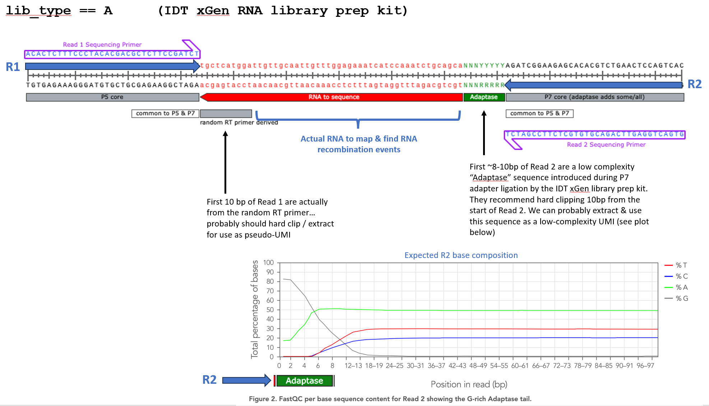
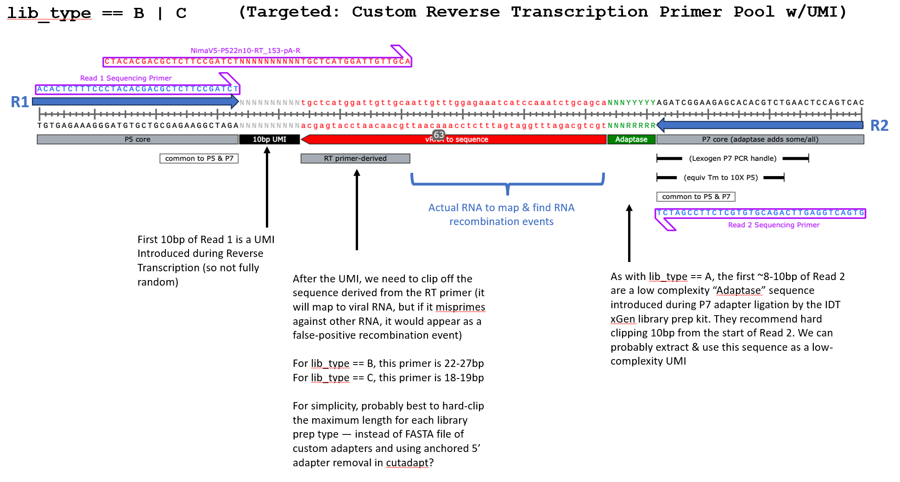

# nf-vjunc

## Description

`nf-vjunc` is a Nextflow (DSL2) pipeline that preprocesses paired-end RNA-seq reads and performs steps to detect viral splicing and junctions. It trims adapters, extracts UMIs, merges overlapping reads, and prepares combined FASTQ outputs for downstream analysis.

## High-level workflow

- Read sample metadata from a samplesheet (CSV).
- Branch samples by library type into two preprocessing workflows:
  - **WORKFLOW_ABCD**: for library types A, B, C, D (includes UMI extraction and hard-trimming)
  - **WORKFLOW_POLYA**: for library type PolyA (simplified workflow without UMI steps)
- Build STAR genome indices for viral-only and host+viral (joint) reference genomes.
- Mix preprocessed outputs from both workflows and align to host genome (`STAR_HOST`).
- Filter host-mapped reads and extract viral reads (`SAMTOOLS_HOST`).
- Align viral reads to viral reference (`STAR_VIRAL`).
- Process viral alignments (`SAMTOOLS_VIRAL`, `BEDTOOLS`).
- Quantify viral junctions and expression (`QUANTIFICATION`).

## Pipeline steps (what it does)

### 1. Metadata and branching

**METADATA**: Load the samplesheet and emit three channels:
- `rawdata`: all samples as tuples of (sample, fastq1, fastq2, gtf, fasta, library)
- `branched_data`: samples split by library type into:
  - `lib_abcd`: samples with library types A, B, C, or D
  - `lib_polya`: samples with library type PolyA
- `refs`: unique (gtf, fasta) pairs for indexing

### 2. STAR indexing (parallel to preprocessing)

**STAR_VIRAL_INDEX**: Build STAR genome index for each unique viral reference (gtf, fasta). Outputs viral index directory.

**STAR_JOINT_INDEX**: Build STAR genome index combining host reference (from params.host_fasta/host_gtf) with each viral reference. Outputs:
- Combined FASTA and GTF files
- Joint genome index directory
- Original gtf and fasta for downstream channel joining

### 3. Preprocessing workflows (library-specific)

#### WORKFLOW_ABCD (for library types A, B, C, D):

1. **TRIMGALORE**: Adapter-trim paired reads → `${sample}_val_1.fq.gz`/`_val_2.fq.gz`
2. **UMITOOLS**: Extract UMIs from trimmed FASTQs → UMI-extracted FASTQs and logs
3. **HARDTRIM**: Library-specific hard trimming:
   - Library A: no hard trimming (just copy files)
   - Library B: hard trim 27bp from R1
   - Libraries C/D: hard trim 19bp from R1
4. **FLASH**: Merge overlapping paired reads → extendedFrags and notCombined files
5. **FASTX**: Reverse-complement and combine:
   - Library A: merged + R1 singletons + reverse-complemented R2 singletons
   - Libraries B/C/D: merged + R1 singletons only
   - Outputs: `combined.fastq.gz` and `combined.reverse.fastq.gz`

#### WORKFLOW_POLYA (for library type PolyA):

1. **TRIMGALORE**: Adapter-trim paired reads → `${sample}_val_1.fq.gz`/`_val_2.fq.gz`
2. **FLASH**: Merge overlapping paired reads → extendedFrags and notCombined files
3. **FASTX**: Reverse-complement and combine:
   - Merged reads + R1 singletons only (no R2 singletons)
   - Outputs: `combined.fastq.gz` and `combined.reverse.fastq.gz`

**Note**: The PolyA workflow skips UMI extraction (UMITOOLS) and hard trimming (HARDTRIM) steps.

### 4. Alignment and analysis

1. **Mix workflows**: Combine outputs from WORKFLOW_ABCD and WORKFLOW_POLYA into single channel
2. **STAR_HOST**: Align preprocessed reads to joint (host+viral) genome index
3. **SAMTOOLS_HOST**: Process host alignments and extract viral reads (unmapped/partially-mapped)
4. **STAR_VIRAL**: Align viral reads to viral-only reference
5. **SAMTOOLS_VIRAL**: Process viral alignments (sort, index)
6. **BEDTOOLS**: Generate coverage and junction information
7. **QUANTIFICATION**: Quantify viral expression and junctions

## Required inputs

### Samplesheet

A samplesheet CSV passed to the `METADATA` workflow. The pipeline expects the CSV to have a header and at minimum the following columns (names used in the pipeline):

- `sample` — unique sample identifier (used as the channel key)
- `fastq1` — path to R1 FASTQ
- `fastq2` — path to R2 FASTQ
- `gtf` — path to viral annotation GTF
- `fasta` — path to viral reference FASTA
- `library` — library type (must be A, B, C, D, or PolyA - what these stand for is detailed below)

### Host reference (required parameters)

The pipeline requires host reference files to be specified via parameters:

- `--host_fasta` — path to host genome FASTA file
- `--host_gtf` — path to host genome GTF annotation file

These are used by `STAR_JOINT_INDEX` to create combined host+viral indices.

Example samplesheet (CSV):

```csv
sample,fastq1,fastq2,gtf,fasta,library
SAMPLE_A,/path/to/SAMPLE_A_R1.fastq.gz,/path/to/SAMPLE_A_R2.fastq.gz,/path/to/genes.gtf,/path/to/ref.fasta,A
SAMPLE_B,/path/to/SAMPLE_B_R1.fastq.gz,/path/to/SAMPLE_B_R2.fastq.gz,/path/to/genes.gtf,/path/to/ref.fasta,B
SAMPLE_POLYA,/path/to/SAMPLE_POLYA_R1.fastq.gz,/path/to/SAMPLE_POLYA_R2.fastq.gz,/path/to/genes.gtf,/path/to/ref.fasta,PolyA
```

Notes:
- The `sample` column must be a unique key and is used for `join` operations. The pipeline assumes the `sample` value is the first element emitted by the metadata channel.
- All file paths should be accessible from the machine / executor running Nextflow. Use absolute or workspace-relative paths.

## Library types

### Library A



- xGen RNA kit step is random primed, with partial P5 adapter included at the 5’end of the random primer. Therefore, the first ~10 bases of Read 1 will be the random primer.
- xGen RT primers xGen multiplex UDI (Swift, X9096 / IDT, 10009816)

- Standard Illumina adapter trimming (trim-galore) in a paired-end fashion, retaining reads >=30bp. Adapter sequence: AGATCGGAAGAGC.
- Even though library type A does not contain designated UMI, we will extract sequence from it to act as pseudo-UMI (umi_tools). The R1 UMI is from the random reverse-transcriptase (RT) primer, while the R2 UMI is in fact a low complexity “Adaptase” sequence introduced during P7 adapter ligation by the IDT xGen library prep kit. 10bp of sequence from each will be moved to the FASTQ headers and hard-clipped from the actual sequence.
- Fragment sizes are expected to be small, so we will collapse overlapping R1 and R2 reads based on a defined minimum overlap (flash). Kmer analysis (jellyfish) of the wuhCor1 genome suggests that the minimum length to produce unique kmers it 18bp, so that would seem to be a good candidate for defining a minimum overlap.
- Combine the collapsed R1/R2 mate-paired reads with R1 reads that failed to overlap and also R2 reads that failed to overlap. This effectively creates a set of single-end reads of varying lengths for downstream analysis.
- The library-prep results in reverse-complement reads, therefore reverse-complement the new FASTQ file to correct for this (fastx_reverse_complement).
- Rearrange the FASTQ headers to keep the UMI at the end, separated by an underscore. The rest is placed before the UMI, separated from the rest of the read name by a backslash. This step is necessary to prevent trimming of the headers resulting in dupicate names from R1 and R2 pairs during subsequent alignment. (sed)

### Library B



- B - targeted - TCS RT primers (396) NEBNext® Multiplex Oligos for Illumina® (96 UDI Primer Pairs) (NEB, E6440S)
- B - TCS - CTACACGACGCTCTTCCGATCTNNNNNNNNNNTCCCCATTGAAGGTGTCA

- Standard Illumina adapter trimming (trim-galore) in a paired-end fashion, retaining reads >=30bp. Adapter sequence: AGATCGGAAGAGC.
- Extract UMIs (umi_tools). The first 10bp of R1 is a UMI introduced during Reverse Transcription (so not fully random). The first 10bp of R2 will be a exracted as a pseudo-UMI. It is in fact a low complexity “Adaptase” sequence introduced during P7 adapter ligation by the IDT xGen library prep kit. Sequence from R1 and R2 will be moved to the FASTQ headers and hard-clipped from the actual sequence.
- Hard-clip the PCR primer from the sequences downstream of the removed R1 UMI. The amount of the sequence to clip is library specific. For library B it is 27bp.
- Fragment sizes are expected to be small, so we will collapse overlapping R1 and R2 reads based on a defined minimum overlap (flash). Kmer analysis (jellyfish) of the wuhCor1 genome suggests that the minimum length to produce unique kmers it 18bp, so that would seem to be a good candidate for defining a minimum overlap.
- Combine the collapsed R1/R2 mate-paired reads with R1 reads that failed to overlap. The R2 singletons are not considered for further analysis. This effectively creates a set of single-end reads of varying lengths for downstream analysis. (cat)
- The library-prep results in reverse-complement reads, therefore reverse-complement the new FASTQ file to correct for this (fastx_reverse_complement).
- Rearrange the FASTQ headers to keep the UMI at the end, separated by an underscore. The rest is placed before the UMI, separated from the rest of the read name by a backslash. This step is necessary to prevent trimming of the headers resulting in dupicate names from R1 and R2 pairs during subsequent alignment. (sed)

### Library C


- C - targeted - Nima RT primers (158)  NEBNext® Multiplex Oligos for Illumina® (96 UDI Primer Pairs) (NEB, E6440S)
- C - Nima - CTACACGACGCTCTTCCGATCTNNNNNNNNNNGGACAAGGCTCTCCATCT

- Standard Illumina adapter trimming (trim-galore) in a paired-end fashion, retaining reads >=30bp. Adapter sequence: AGATCGGAAGAGC.
- Extract UMIs (umi_tools). The first 10bp of R1 is a UMI introduced during Reverse Transcription (so not fully random). The first 10bp of R2 will be a exracted as a pseudo-UMI. It is in fact a low complexity “Adaptase” sequence introduced during P7 adapter ligation by the IDT xGen library prep kit. Sequence from R1 and R2 will be moved to the FASTQ headers and hard-clipped from the actual sequence.
- Hard-clip the PCR primer from the sequences downstream of the removed R1 UMI. The amount of the sequence to clip is library specific. For library C it is 19bp.
- Fragment sizes are expected to be small, so we will collapse overlapping R1 and R2 reads based on a defined minimum overlap (flash). Kmer analysis (jellyfish) of the wuhCor1 genome suggests that the minimum length to produce unique kmers it 18bp, so that would seem to be a good candidate for defining a minimum overlap.
- Combine the collapsed R1/R2 mate-paired reads with R1 reads that failed to overlap. The R2 singletons are not considered for further analysis. This effectively creates a set of single-end reads of varying lengths for downstream analysis. (cat)
- The library-prep results in reverse-complement reads, therefore reverse-complement the new FASTQ file to correct for this (fastx_reverse_complement).
- Rearrange the FASTQ headers to keep the UMI at the end, separated by an underscore. The rest is placed before the UMI, separated from the rest of the read name by a backslash. This step is necessary to prevent trimming of the headers resulting in dupicate names from R1 and R2 pairs during subsequent alignment. (sed)

### Library D

- This is the same as library type C, but with a polyA selection step.
- Processed identically to library type C (19bp hard trim).

### Library PolyA

- PolyA-selected library with simplified preprocessing workflow
- **No UMI extraction**: Unlike libraries A-D, this library type does not use UMI tools
- **No hard trimming**: No primer sequences to hard-clip from R1

**Processing steps**:
- Standard Illumina adapter trimming (trim-galore) in a paired-end fashion, retaining reads >=30bp. Adapter sequence: AGATCGGAAGAGC.
- Fragment sizes are expected to be small, so we collapse overlapping R1 and R2 reads based on a defined minimum overlap (flash). Minimum overlap is 18bp.
- Combine the collapsed R1/R2 mate-paired reads with R1 reads that failed to overlap. R2 singletons are not considered for further analysis. This effectively creates a set of single-end reads of varying lengths for downstream analysis.
- The library-prep results in reverse-complement reads, therefore reverse-complement the new FASTQ file to correct for this (fastx_reverse_complement).

## How to run

Minimal example (from the pipeline root):

```bash
#!/bin/bash

# Load modules
ml purge
ml Singularity/3.11.3
ml Nextflow/25.04.4

# Pull the latest nf-vjunc repository
nextflow pull dbauerlab/nf-vjunc

# Run Nextflow pipeline
nextflow run dbauerlab/nf-vjunc \
    -profile crick \
    -r polya \
    -resume \
    --input samplesheet.csv \
    --host_fasta /path/to/host/genome.fa \
    --host_gtf /path/to/host/annotation.gtf
```

Provide your actual `samplesheet.csv` path.

## Outputs

### Reference indices
- **STAR viral indices**: `${params.outdir}/indices/viral/` - viral-only STAR genome indices
- **STAR joint indices**: `${params.outdir}/indices/joint/` - combined host+viral STAR genome indices
- **Joint references**: 
  - `${params.outdir}/joint_fasta/` - combined host+viral FASTA files
  - `${params.outdir}/joint_gtf/` - combined host+viral GTF annotations

### Preprocessing outputs (library-dependent)

**For libraries A, B, C, D**:
- **Trimmed FASTQs**: `${params.outdir}/abcd/adapter_trim/`
- **UMI outputs and logs**: `${params.outdir}/abcd/umitools/`
- **Hard trimmed reads**: `${params.outdir}/abcd/hardtrim/`
- **Merged reads**: `${params.outdir}/abcd/merged/`
- **Final combined FASTQs**: `${params.outdir}/abcd/fastx/`

**For library PolyA**:
- **Trimmed FASTQs**: `${params.outdir}/polya/adapter_trim/`
- **Merged reads**: `${params.outdir}/polya/merged/`
- **Final combined FASTQs**: `${params.outdir}/polya/fastx/`

### Alignment and analysis outputs
- **Host alignments**: `${params.outdir}/star_host/`
- **Host BAM processing**: `${params.outdir}/samtools_host/`
- **Viral alignments**: `${params.outdir}/star_viral/`
- **Viral BAM processing**: `${params.outdir}/samtools_viral/`
- **Coverage and junctions**: `${params.outdir}/bedtools/`
- **Quantification results**: `${params.outdir}/quantification/`

## Technical details

### Workflow branching and mixing

The pipeline branches samples by library type after metadata loading:

- **Branching**: METADATA workflow splits samples into two branches:
  - `lib_abcd`: libraries A, B, C, D → routed to WORKFLOW_ABCD
  - `lib_polya`: library PolyA → routed to WORKFLOW_POLYA
- **Parallel processing**: Both workflows run in parallel
- **Mixing**: Outputs from both workflows are combined using `.mix()` before alignment
- **Benefit**: Allows library-specific processing while maintaining unified downstream analysis

### Channel joining and keying

The pipeline uses composite key strategies to match samples with their corresponding STAR indices:

- **Composite key format**: `${gtf.getName()}::${fasta.getName()}` (using just filenames, not full paths)
- **Key creation points**:
  1. `joint_keyed`: STAR_JOINT_INDEX outputs keyed by gtf::fasta
  2. `viral_keyed`: STAR_VIRAL_INDEX outputs keyed by gtf::fasta
  3. `all_preprocessed_keyed`: Mixed FASTX outputs keyed by gtf::fasta
  4. `samtools_pre_keyed`: SAMTOOLS_HOST viral outputs keyed by gtf::fasta
- **Join operations**:
  - Preprocessed samples + joint indices → STAR_HOST input
  - SAMTOOLS_HOST viral outputs + viral indices → STAR_VIRAL input
- **Combine method**: Uses `.combine(by: 0)` for Cartesian product filtered by matching keys

### Diagnostic outputs

The pipeline includes optional diagnostic views (commented out by default) that can be enabled to print:
- `joint_keyed` - STAR joint index channels with keys
- `viral_keyed` - STAR viral index channels with keys
- `all_preprocessed` - mixed outputs from both preprocessing workflows
- `all_preprocessed_keyed` - preprocessed outputs with composite keys
- `joined_for_host` - matched samples and joint indices for STAR_HOST
- `samtools_pre_keyed` - SAMTOOLS_HOST outputs with keys
- `joined_for_viral` - matched samples and viral indices for STAR_VIRAL

To enable diagnostics, uncomment the `.view{}` lines in main.nf.

## Tips & caveats

- **Library type specification**: Ensure the `library` column in your samplesheet uses exactly: A, B, C, D, or PolyA (case-sensitive)
- **Branching logic**: Samples are automatically routed to the appropriate workflow based on library type
- **Channel combining**: The pipeline uses `.combine(by: 0)` to join channels by composite keys, creating a Cartesian product filtered by matching first element
- **STAR index generation**: Automatically calculates `genomeSAindexNbases` based on genome length using: `min(14, max(4, int(log2(genomeLength)/2 - 1)))`
- **PolyA simplification**: If your samples are PolyA-selected and don't require UMI processing, use library type "PolyA" for faster preprocessing
- **Output organization**: Preprocessing outputs are separated by workflow (abcd/ vs polya/ directories), but alignment outputs are unified